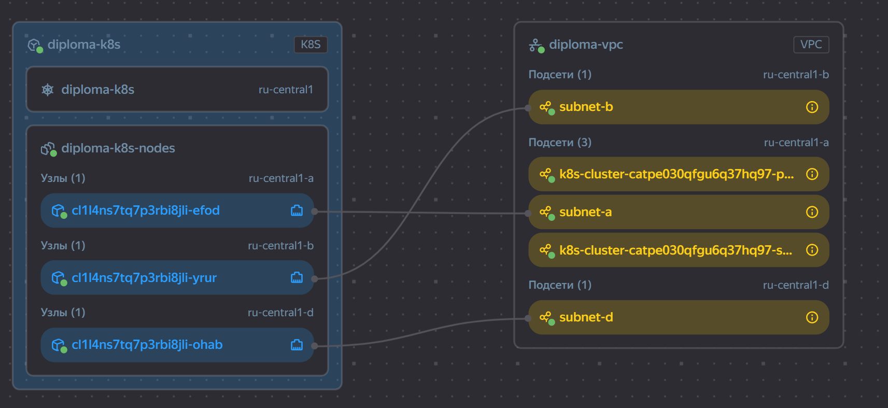
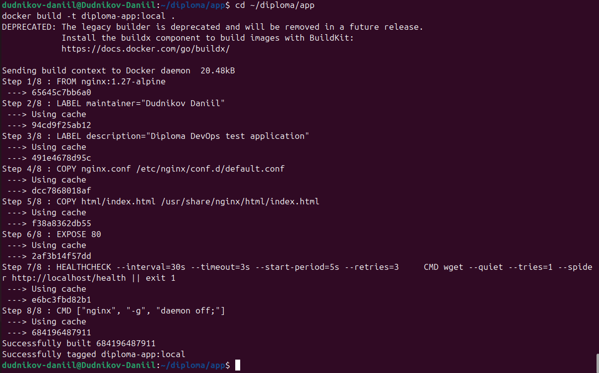
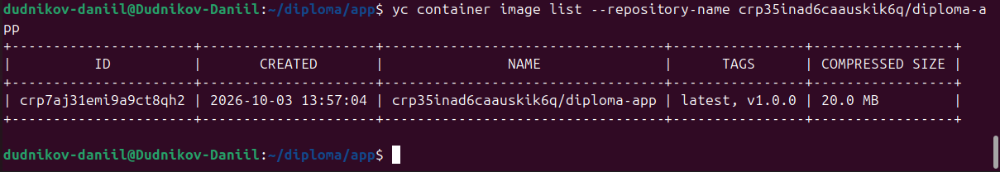
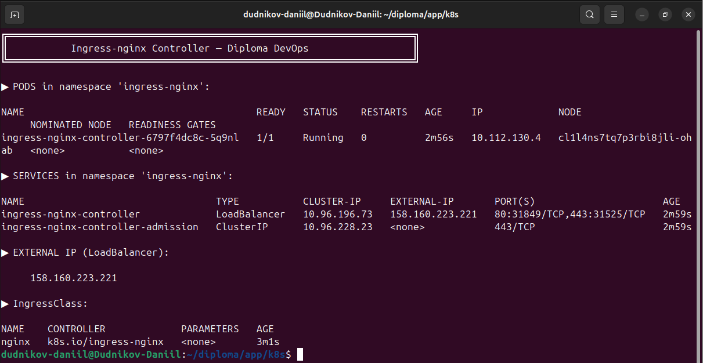
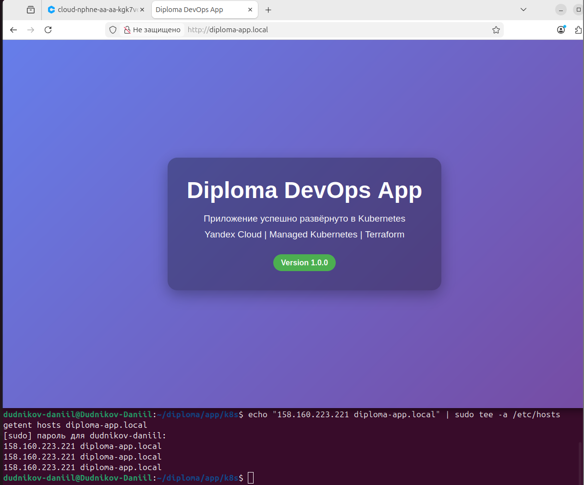
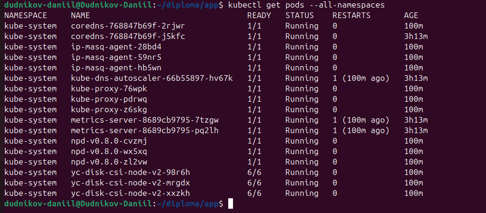
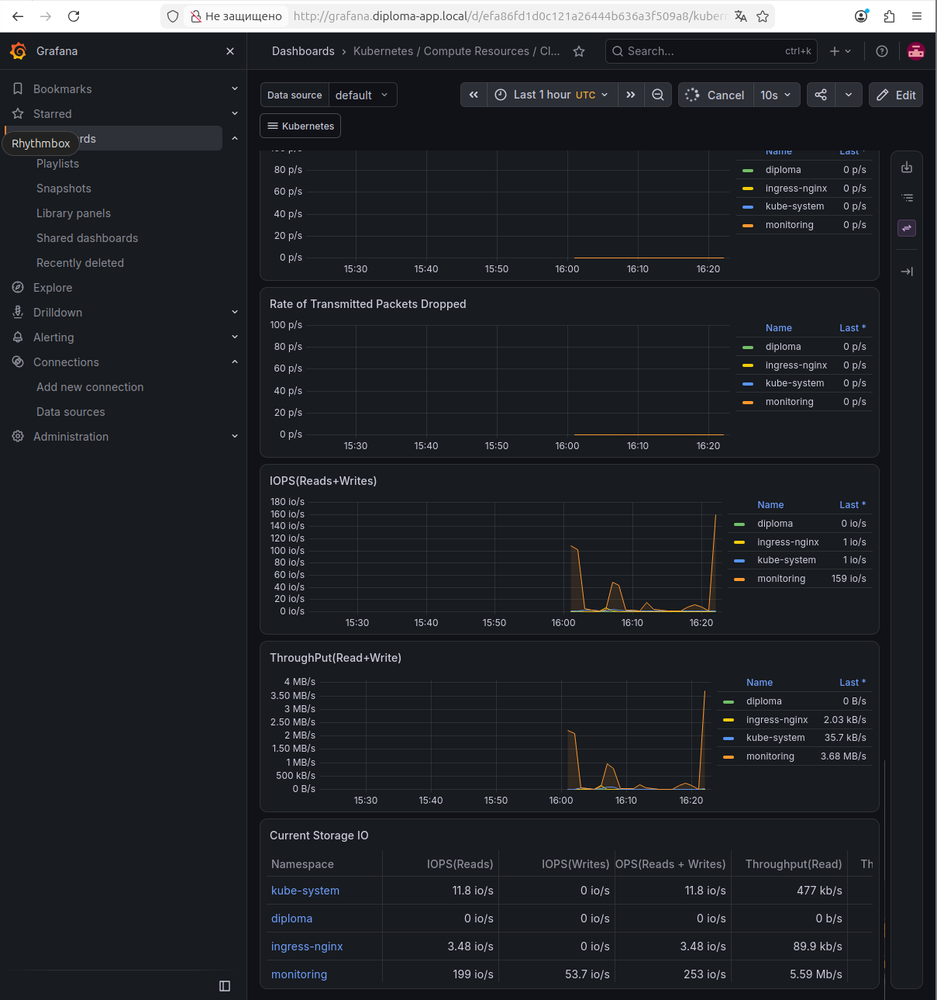
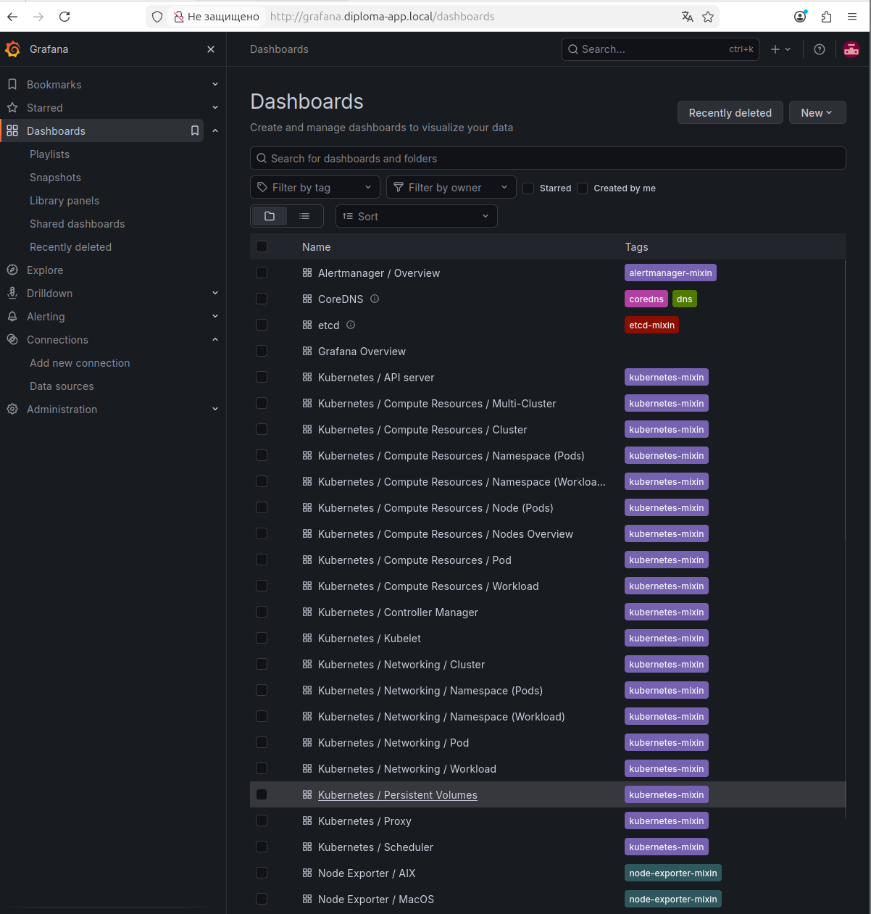

# Diploma DevOps Test Application

[](https://kubernetes.io/)
[](https://www.terraform.io/)
[](https://www.docker.com/)
[](https://cloud.yandex.ru/)

Тестовое приложение для дипломного практикума в Yandex.Cloud.

**Автор:** Дудников Даниил
**Период работы:** 3 октября 2026 — <дата защиты>

---

## Описание

Простое nginx-приложение, отдающее статическую HTML-страницу.
Используется для демонстрации полного DevOps-цикла:

- Сборка Docker-образа
- Push в Yandex Container Registry
- Деплой в Managed Kubernetes (Yandex Managed Service for Kubernetes)
- Работа CI/CD pipeline (GitHub Actions)
- Мониторинг через Prometheus + Grafana

Приложение упаковано в лёгкий образ `nginx:1.27-alpine` (≈ 50 МБ),
отдаёт статику и имеет health-check endpoint `/health` для Kubernetes-проб.

---

## Архитектура

```bash
┌──────────────────────────────────────────────────────────────┐
│                      Yandex.Cloud                            │
│                                                              │
│  ┌────────────────────────────────────────────────────────┐  │
│  │  Managed Kubernetes (diploma-k8s, v1.33)               │  │
│  │                                                        │  │
│  │  ┌──────────┐  ┌──────────┐  ┌──────────┐             │  │
│  │  │  node-a  │  │  node-b  │  │  node-d  │             │  │
│  │  │ ru-c-a   │  │ ru-c-b   │  │ ru-c-d   │             │  │
│  │  └────┬─────┘  └────┬─────┘  └────┬─────┘             │  │
│  │       │             │             │                    │  │
│  │       └──────┬──────┴──────┬──────┘                    │  │
│  │              │             │                            │  │
│  │        ┌─────▼─────┐  ┌────▼─────┐                     │  │
│  │        │ diploma-  │  │ kube-    │                     │  │
│  │        │ app (svc) │  │ prometh. │                     │  │
│  │        └─────┬─────┘  └──────────┘                     │  │
│  │              │                                          │  │
│  └──────────────┼──────────────────────────────────────────┘  │
│                 │                                             │
│         ┌───────▼────────┐                                    │
│         │  Ingress / LB  │                                    │
│         └───────┬────────┘                                    │
└─────────────────┼─────────────────────────────────────────────┘
                  │
              ┌───▼────┐
              │ Client │
              └────────┘
```

Образ приложения хранится в **Yandex Container Registry**, откуда его забирает
Kubernetes при деплое.

---

## Инфраструктура как код (Terraform)

Проект разделён на два Terraform-модуля:

| Модуль            | Назначение                              | Backend    |
|-------------------|-----------------------------------------|------------|
| `bootstrap/`      | SA, роли, S3 bucket для state           | локальный  |
| `infrastructure/` | VPC, подсети, SG, K8s, Node Group       | S3         |

**S3 backend:**

- Bucket: `diploma-tfstate-dudnikov-7efeef`
- Key: `infrastructure/terraform.tfstate`
- Версионирование: включено
- Lifecycle: удаление старых версий через 30 дней
- Лимит: 1 GB

---

## Технологии

| Компонент         | Версия       | Назначение             |
|-------------------|--------------|------------------------|
| nginx             | 1.27-alpine  | Веб-сервер             |
| Docker            | 29.1.3       | Контейнеризация        |
| Kubernetes        | 1.33 (STABLE)| Оркестрация            |
| Yandex Cloud      | —            | Облачная платформа     |
| YC Container Reg. | —            | Хранение образов       |
| Terraform         | 1.14.0       | IaC                    |
| Helm              | 4.3.0        | Пакетный менеджер      |
| GitHub Actions    | —            | CI/CD                  |

---

## Структура репозиториев

Проект состоит из **трёх репозиториев** (рекомендуется хранить на GitHub):

| Репозиторий                 | Назначение                                              |
|-----------------------------|---------------------------------------------------------|
| `terraform-bootstrap`       | SA, роли, S3 bucket для state                           |
| `terraform-infrastructure`  | VPC, K8s, Node Group                                    |
| `diploma-app` (этот)        | Приложение, Dockerfile, K8s-манифесты, CI/CD            |

### Структура `diploma-app`

```bash
.
├── Dockerfile                # Инструкции для сборки образа
├── nginx.conf                # Конфигурация nginx
├── html/
│   └── index.html            # Статическая страница
├── k8s/                      # Манифесты Kubernetes
│   ├── namespace.yaml
│   ├── deployment.yaml
│   ├── service.yaml
│   ├── ingress.yaml
│   └── grafana-ingress.yaml
├── docs/
│   └── screenshots/          # Скриншоты проекта
├── .github/
│   └── workflows/
│       └── ci-cd.yaml        # CI/CD pipeline
├── .gitignore
└── README.md
```

---
## Быстрый старт

### Сборка Docker-образа

```
docker build -t diploma-app:local .
docker run --rm -p 8080:80 diploma-app:local
# Открыть http://localhost:8080
```

### Push в Yandex Container Registry

```
yc container registry configure-docker
docker build -t cr.yandex/crp35inad6caauskik6q/diploma-app:v1.0.0 .
docker push cr.yandex/crp35inad6caauskik6q/diploma-app:v1.0.0
```

### Деплой в Kubernetes

```
kubectl apply -f k8s/
kubectl get pods -n diploma
kubectl get ingress -n diploma
```

---

## Скриншоты

### Инфраструктура и сборка






### Kubernetes







### Мониторинг







---

## Проблемы и решения

| Этап        | Проблема                                  | Решение                                              |
|-------------|-------------------------------------------|------------------------------------------------------|
| Подготовка  | Docker не мог скачать образы              | Отключили IPv6 в `/etc/docker/daemon.json`           |
| Подготовка  | yc CLI таймаутил на resource-manager      | Отключили IPv6 в системе                             |
| Bootstrap   | PermissionDenied при создании SA          | Добавили роли `iam.admin`, `resource-manager.admin`  |
| K8s         | Node Group зависла на 43 мин              | Добавили роль `compute.editor` SA нод                |
| K8s         | Disk size 20 GB < min 30 GB               | Увеличили до 30 GB                                   |
| K8s         | Прерываемые ВМ не создавались             | Отказались от `preemptible = true`                   |
| Мониторинг  | Alertmanager не мог скачать образ         | Использовали `quay.io` напрямую                      |
| Мониторинг  | Grafana падала из-за SQLite               | `skipTlsVerify: true` + больше памяти                |

---

## Прогресс проекта

**Текущий статус:** ~95%

- [x] Подготовка рабочей машины
- [x] Bootstrap Terraform
- [x] Облачная инфраструктура
- [x] Managed Kubernetes кластер
- [x] Node group (3 ноды)
- [x] Тестовое приложение + YCR
- [x] Мониторинг (Prometheus + Grafana + Alertmanager)
- [ ] CI/CD (GitHub Actions)
- [ ] Финальные скриншоты

---

## Автор

**Дудников Даниил**
Дипломный практикум в Yandex.Cloud — 2026

---

## Лицензия

Учебный проект, созданный в рамках дипломного практикума.
Свободное использование в образовательных целях.

© 2026, Дудников Даниил
