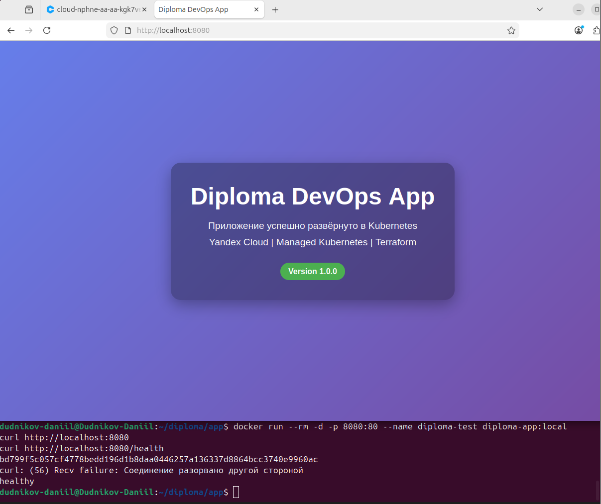
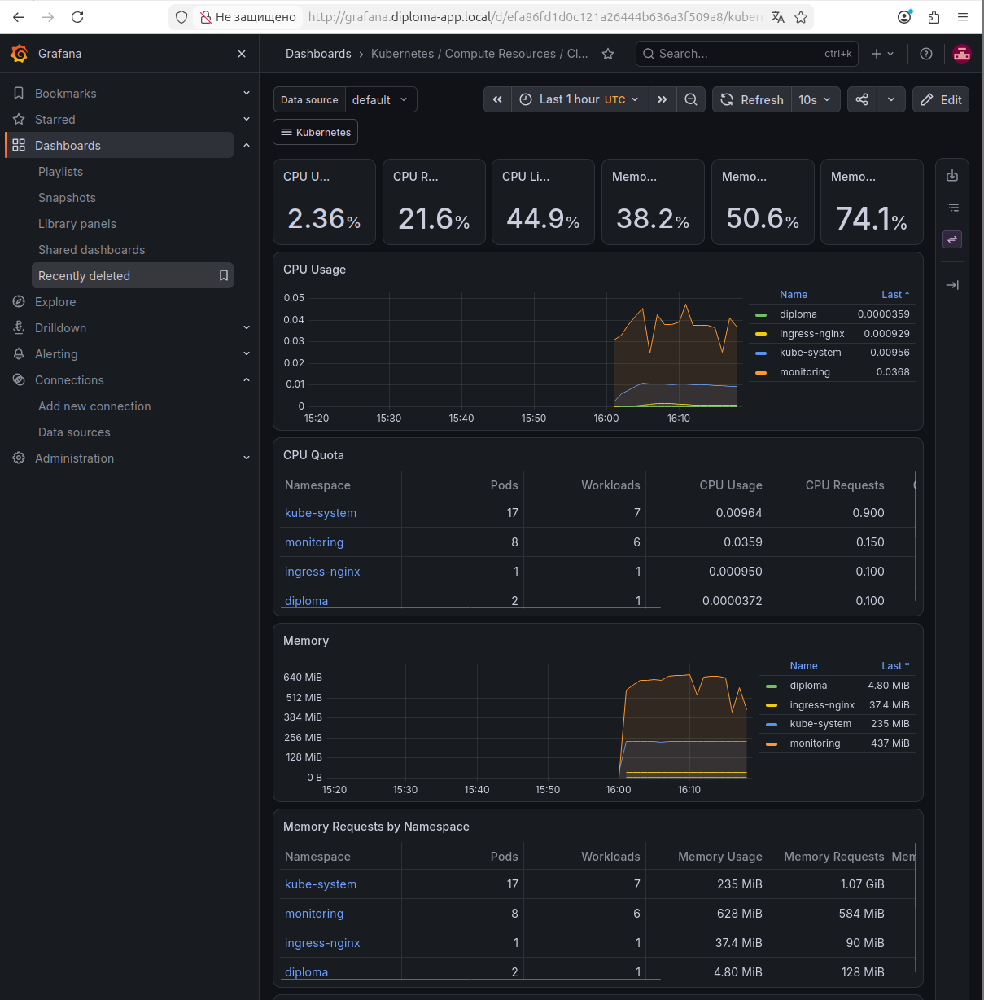
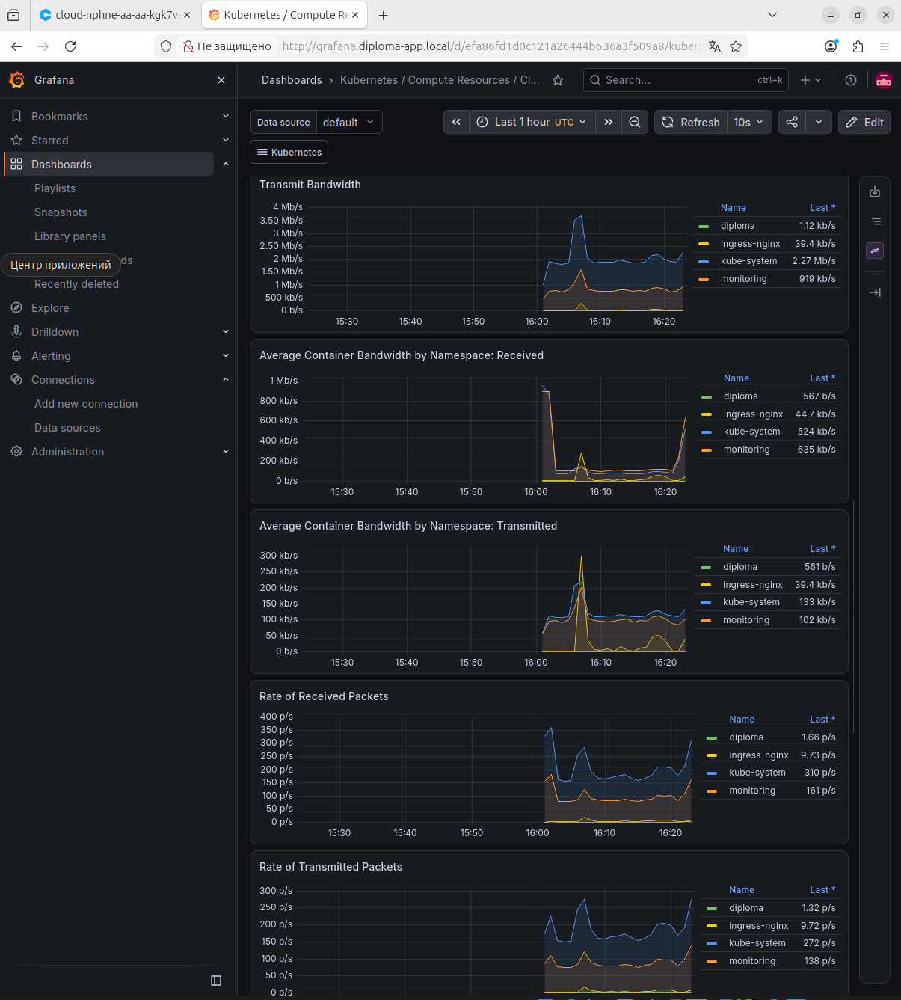
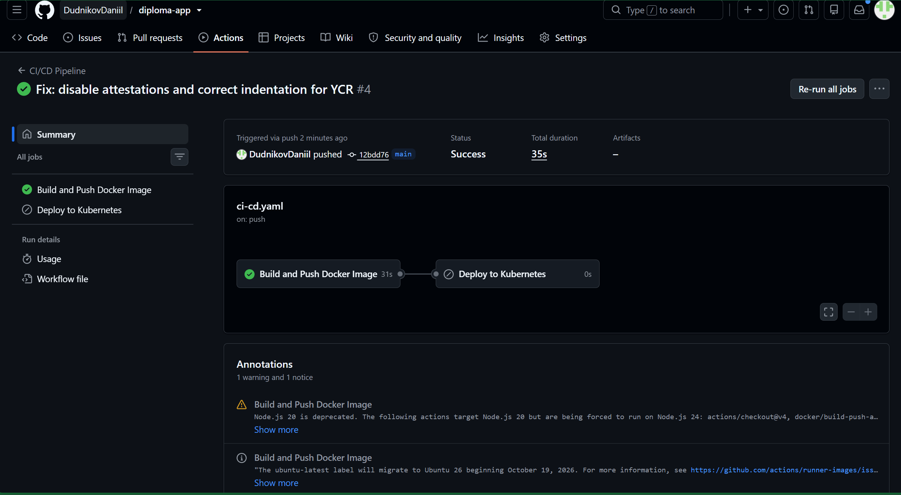
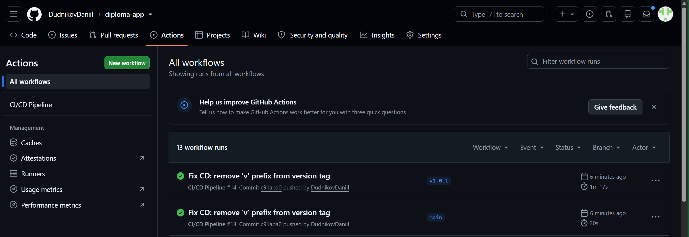

# Diploma DevOps Test Application

[](https://kubernetes.io/)
[](https://www.terraform.io/)
[](https://www.docker.com/)
[](https://cloud.yandex.ru/)

Тестовое приложение для дипломного практикума в Yandex.Cloud.

**Автор:** Дудников Даниил
**Период работы:** 3 октября 2026 — <дата защиты>

---

## Описание

Простое nginx-приложение, отдающее статическую HTML-страницу.
Используется для демонстрации полного DevOps-цикла:

- Сборка Docker-образа
- Push в Yandex Container Registry
- Деплой в Managed Kubernetes (Yandex Managed Service for Kubernetes)
- Работа CI/CD pipeline (GitHub Actions)
- Мониторинг через Prometheus + Grafana

Приложение упаковано в лёгкий образ `nginx:1.27-alpine` (≈ 50 МБ),
отдаёт статику и имеет health-check endpoint `/health` для Kubernetes-проб.

---

## Архитектура

```bash
┌──────────────────────────────────────────────────────────────┐
│                      Yandex.Cloud                            │
│                                                              │
│  ┌────────────────────────────────────────────────────────┐  │
│  │  Managed Kubernetes (diploma-k8s, v1.33)               │  │
│  │                                                        │  │
│  │  ┌──────────┐  ┌──────────┐  ┌──────────┐              │  │
│  │  │  node-a  │  │  node-b  │  │  node-d  │              │  │
│  │  │ ru-c-a   │  │ ru-c-b   │  │ ru-c-d   │              │  │
│  │  └────┬─────┘  └────┬─────┘  └────┬─────┘              │  │
│  │       │             │             │                    │  │
│  │       └──────┬──────┴──────┬──────┘                    │  │
│  │              │             │                           │  │
│  │        ┌─────▼─────┐  ┌────▼─────┐                     │  │
│  │        │ diploma-  │  │ kube-    │                     │  │
│  │        │ app (svc) │  │ prometh. │                     │  │
│  │        └─────┬─────┘  └──────────┘                     │  │
│  │              │                                         │  │
│  └──────────────┼─────────────────────────────────────────┘  │
│                 │                                            │
│         ┌───────▼────────┐                                   │
│         │  Ingress / LB  │                                   │
│         └───────┬────────┘                                   │
└─────────────────┼────────────────────────────────────────────┘
                  │
              ┌───▼────┐
              │ Client │
              └────────┘
```

Образ приложения хранится в **Yandex Container Registry**, откуда его забирает
Kubernetes при деплое.

---

## Инфраструктура как код (Terraform)

Проект разделён на два Terraform-модуля:

| Модуль            | Назначение                              | Backend    |
|-------------------|-----------------------------------------|------------|
| `bootstrap/`      | SA, роли, S3 bucket для state           | локальный  |
| `infrastructure/` | VPC, подсети, SG, K8s, Node Group       | S3         |

**S3 backend:**

- Bucket: `diploma-tfstate-dudnikov-7efeef`
- Key: `infrastructure/terraform.tfstate`
- Версионирование: включено
- Lifecycle: удаление старых версий через 30 дней
- Лимит: 1 GB

---

## Технологии

| Компонент         | Версия       | Назначение             |
|-------------------|--------------|------------------------|
| nginx             | 1.27-alpine  | Веб-сервер             |
| Docker            | 29.1.3       | Контейнеризация        |
| Kubernetes        | 1.33 (STABLE)| Оркестрация            |
| Yandex Cloud      | —            | Облачная платформа     |
| YC Container Reg. | —            | Хранение образов       |
| Terraform         | 1.14.0       | IaC                    |
| Helm              | 4.3.0        | Пакетный менеджер      |
| GitHub Actions    | —            | CI/CD                  |

---

## Структура репозиториев

Проект состоит из **трёх репозиториев** (рекомендуется хранить на GitHub):

| Репозиторий                 | Назначение                                              |
|-----------------------------|---------------------------------------------------------|
| `terraform-bootstrap`       | SA, роли, S3 bucket для state                           |
| `terraform-infrastructure`  | VPC, K8s, Node Group                                    |
| `diploma-app` (этот)        | Приложение, Dockerfile, K8s-манифесты, CI/CD            |

**Ссылки на репозитории:**

- [terraform-bootstrap](https://github.com/DudnikovDaniil/terraform-bootstrap)
- [terraform-infrastructure](https://github.com/DudnikovDaniil/terraform-infrastructure)
- [diploma-app](https://github.com/DudnikovDaniil/diploma-app)

### Структура `diploma-app`

```bash
.
├── Dockerfile                # Инструкции для сборки образа
├── nginx.conf                # Конфигурация nginx
├── html/
│   └── index.html            # Статическая страница
├── k8s/                      # Манифесты Kubernetes
│   ├── namespace.yaml
│   ├── deployment.yaml
│   ├── service.yaml
│   ├── ingress.yaml
│   └── grafana-ingress.yaml
├── docs/
│   ├── README.md
│   └── evidence/             # Материалы по этапам
│       ├── 01-infrastructure/
│       ├── 02-application/
│       ├── 03-monitoring/
│       └── 04-ci-cd/
├── .github/
│   └── workflows/
│       └── ci-cd.yaml        # CI/CD pipeline
├── .gitignore
└── README.md
```

---
## Быстрый старт

### Сборка Docker-образа

```
docker build -t diploma-app:local .
docker run --rm -p 8080:80 diploma-app:local
# Открыть http://localhost:8080
```

### Push в Yandex Container Registry

```
yc container registry configure-docker
docker build -t cr.yandex/crp35inad6caauskik6q/diploma-app:v1.0.0 .
docker push cr.yandex/crp35inad6caauskik6q/diploma-app:v1.0.0
```

### Деплой в Kubernetes

```
kubectl apply -f k8s/
kubectl get pods -n diploma
kubectl get ingress -n diploma
```

---

## Материалы по этапам

Все скриншоты и логи разложены по этапам в `docs/evidence/`.
В каждой папке — свой `README.md` с пояснениями.

### 01. Инфраструктура Yandex Cloud

- [README и подписи к скриншотам](docs/evidence/01-infrastructure/README.md)


*Карта инфраструктуры в консоли Yandex Cloud: VPC, подсети, кластер, ноды.*


*`kubectl get nodes` — три worker-ноды в статусе Ready, по одной в каждой зоне.*


*Системные поды Kubernetes в норме — кластер готов принимать нагрузку.*

---

### 02. Тестовое приложение

- [README и подписи к скриншотам](docs/evidence/02-application/README.md)



*Приложение, запущенное локально через `docker run` на localhost:8080.*


*Процесс сборки образа из Dockerfile.*


*Образ `diploma-app:v1.0.0` в Yandex Container Registry.*


*То же приложение, но уже через ingress в кластере.*

---

### 03. Мониторинг

- [README и подписи к скриншотам](docs/evidence/03-monitoring/README.md)



*Дашборд Grafana с графиками загрузки CPU и памяти кластера.*


*Дисковые метрики — IOPS, throughput, использование места.*



*Сетевые метрики — трафик, ошибки, drops.*


*Список готовых дашбордов из kube-prometheus-stack.*

---

### 04. CI/CD Pipeline

- [README и подписи к скриншотам](docs/evidence/04-ci-cd/README.md)



*CI pipeline: сборка и push образа по коммиту в `main`.*



*CD pipeline: деплой в кластер по созданию тега `v1.0.1`.*

---

## Проблемы и решения

| Этап        | Проблема                                  | Решение                                              |
|-------------|-------------------------------------------|------------------------------------------------------|
| Подготовка  | Docker не мог скачать образы              | Отключили IPv6 в `/etc/docker/daemon.json`           |
| Подготовка  | yc CLI таймаутил на resource-manager      | Отключили IPv6 в системе                             |
| Bootstrap   | PermissionDenied при создании SA          | Добавили роли `iam.admin`, `resource-manager.admin`  |
| K8s         | Node Group зависла на 43 мин              | Добавили роль `compute.editor` SA нод                |
| K8s         | Disk size 20 GB < min 30 GB               | Увеличили до 30 GB                                   |
| K8s         | Прерываемые ВМ не создавались             | Отказались от `preemptible = true`                   |
| Мониторинг  | Alertmanager не мог скачать образ         | Использовали `quay.io` напрямую                      |
| Мониторинг  | Grafana падала из-за SQLite               | `skipTlsVerify: true` + больше памяти                |

---

## Прогресс проекта

**Текущий статус:** ~100%

- [x] Подготовка рабочей машины
- [x] Bootstrap Terraform
- [x] Облачная инфраструктура
- [x] Managed Kubernetes кластер
- [x] Node group (3 ноды)
- [x] Тестовое приложение + YCR
- [x] Мониторинг (Prometheus + Grafana + Alertmanager)
- [x] CI/CD (GitHub Actions)
- [x] Финальные скриншоты и документация

---

##  Итоги работы

### Что сделано

За время практикума **развёрнут полный DevOps-цикл** для тестового приложения:

1. **Инфраструктура как код** — Terraform-модули создают VPC, 3 подсети в 3 зонах доступности, Security Group, Managed Kubernetes кластер и Node Group из 3 нод. State хранится в S3-бакете (bootstrap-модуль).

2. **Контейнеризация** — приложение упаковано в Docker-образ на базе `nginx:1.27-alpine` (≈ 50 МБ), загружено в Yandex Container Registry.

3. **Оркестрация** — приложение задеплоено в Managed Kubernetes (v1.33, региональный мастер). Настроены Deployment (2 реплики), Service, Ingress, RBAC для CI/CD.

4. **Мониторинг** — установлен `kube-prometheus-stack`: Prometheus, Grafana, Alertmanager, Node Exporter, Kube State Metrics. Настроены дашборды и Ingress для Grafana.

5. **CI/CD** — настроен GitHub Actions pipeline:
   - **CI** — сборка и push Docker-образа при коммите в `main`.
   - **CD** — автоматический деплой в Kubernetes при создании тега `v*.*.*`.

### Чему научился

- **Terraform** — IaC, remote state в S3, модульная структура, работа с провайдером Yandex Cloud.
- **Kubernetes** — Managed K8s, Node Group, Deployment, Service, Ingress, RBAC, работа с `kubectl`.
- **Docker** — сборка образов, multi-stage, работа с реестрами.
- **CI/CD** — GitHub Actions, работа с секретами, автоматизация сборки и деплоя.
- **Мониторинг** — Prometheus, Grafana, Alertmanager, готовые дашборды.
- **Отладка** — решение реальных проблем: IPv6 в VirtualBox, IAM-роли, несовместимость тегов, RBAC для CI/CD.

### Что было самым сложным

| Проблема | Решение |
|----------|---------|
| Docker не мог скачать образы | Отключил IPv6 в `/etc/docker/daemon.json` |
| `yc` CLI таймаутил | Отключил IPv6 в системе |
| Node Group зависла на 43 мин | Добавил роль `compute.editor` SA нод |
| Disk size 20 GB < min 30 GB | Увеличил до 30 GB |
| CI/CD не мог деплоить | Настроил RBAC для `github-actions-sa` |
| Тег образа не совпадал | Убрал `v` из версии в workflow |

### Что получилось

-  **3 репозитория на GitHub** — приложение, bootstrap, infrastructure.
-  **~30 скриншотов** — полное подтверждение работы.
-  **Работающий CI/CD** — от коммита до деплоя без ручных действий.
-  **Полный мониторинг** — Grafana с дашбордами K8s.
-  **Документация** — README с описанием каждого этапа.

### Перспективы развития

- **HashiCorp Vault** — для управления секретами.
- **ArgoCD** — GitOps-подход для деплоя.
- **Terraform Cloud** — управление state и планирование.
- **Multi-environment** — dev/staging/prod.
- **Автоскейлинг** — HPA и Cluster Autoscaler.

---

## Обучение

Работа выполнена в рамках курса:

**DevOps-инженер с нуля: расширенный курс**
11 апреля 2025 — 26 октября 2026

- **Группа:** FOPS-41
- **Студент:** Дудников Даниил Дмитриевич
