# 01. Инфраструктура Yandex Cloud

Всё, что связано с первым этапом практикума: подготовка облачной
инфраструктуры через Terraform, создание VPC, подсетей, S3-бакета
для state и Managed Kubernetes кластера с рабочей группой нод.

Каждый пункт ниже — это скриншот и краткое пояснение, что на нём
и зачем он нужен.

---

## 01-kubectl-nodes — ноды кластера

**Что видно:** три worker-ноды кластера `diploma-k8s` в статусе `Ready`.
Каждая нода — в своей зоне доступности (`ru-central1-a`, `-b`, `-d`),
что обеспечивает отказоустойчивость при падении одной зоны.

**Зачем:** подтверждает, что кластер собран правильно и все ноды
зарегистрировались в control plane.

---

## 02-kubectl-pods — поды в kube-system

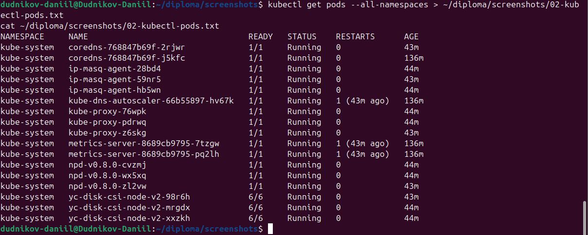

**Что видно:** системные поды Kubernetes (CoreDNS, kube-proxy, metrics-server,
CSI-драйверы) в статусе `Running`.

**Зачем:** подтверждает, что control plane и системные компоненты
работают штатно, кластер готов принимать пользовательские нагрузки.

---

## 03a-cluster-list — список кластеров

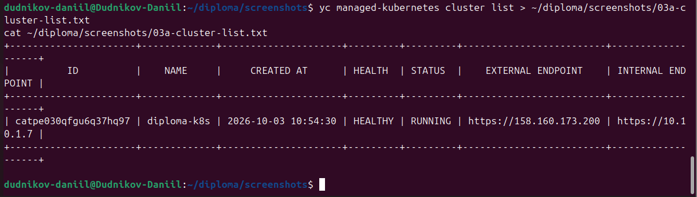

**Что видно:** кластер `diploma-k8s` в статусе `RUNNING`, версия 1.33,
региональный мастер.

**Зачем:** подтверждает, что кластер создан через Terraform
и управляется Yandex Managed Service for Kubernetes.

---

## 03b-cluster-details — детали кластера

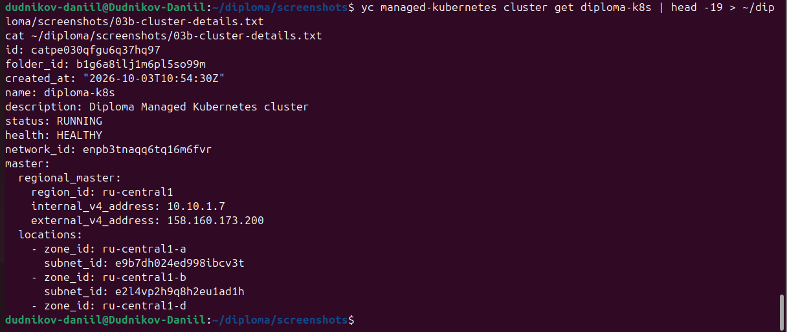

**Что видно:** детальная информация о кластере — ID, версия,
endpoint, сервисный аккаунт, канареечный релиз-канал `STABLE`.

**Зачем:** подтверждает корректность параметров, заданных в Terraform.

---

## 04a-nodegroup-list — список Node Group

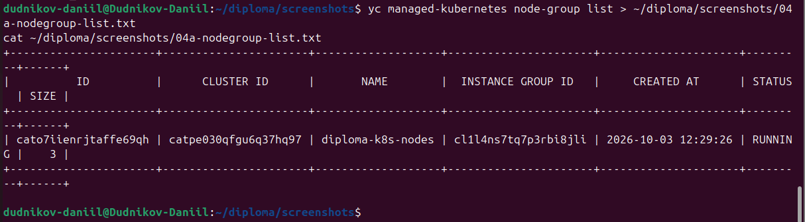

**Что видно:** одна node group `diploma-k8s-nodes` с тремя нодами.

**Зачем:** подтверждает, что ноды разнесены по трём зонам доступности.

---

## 04b-nodegroup-details — детали Node Group

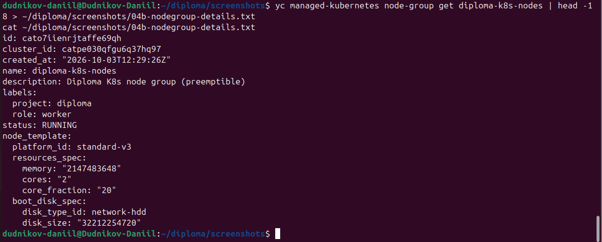

**Что видно:** параметры группы — платформа `standard-v3`,
2 vCPU (20% гарантии), 2 GB RAM, диск 30 GB HDD.

**Зачем:** подтверждает экономию ресурсов купона без потери
работоспособности кластера.

---

## 05-instances-list — 3 ВМ

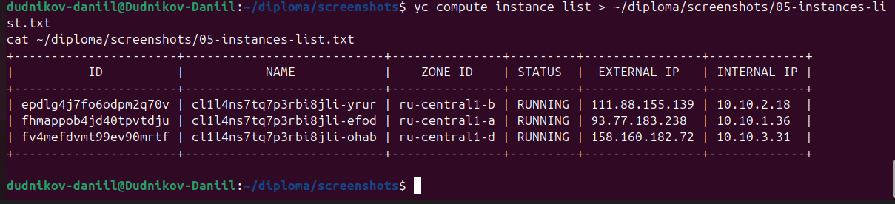

**Что видно:** три виртуальные машины, созданные Managed Kubernetes
под worker-ноды.

**Зачем:** видно, что инфраструктура реально существует
в Compute Cloud, а не только на бумаге.

---

## 06-network-resources — VPC, подсети, SG

**Что видно:** VPC `diploma-vpc`, три подсети в трёх зонах доступности
(10.10.1.0/24, 10.10.2.0/24, 10.10.3.0/24) и security group
`diploma-k8s-sg` с правилами ingress/egress.

**Зачем:** подтверждает, что сеть спроектирована по требованиям
практикума и изолирована.

---

## 07-storage-bucket — S3 bucket

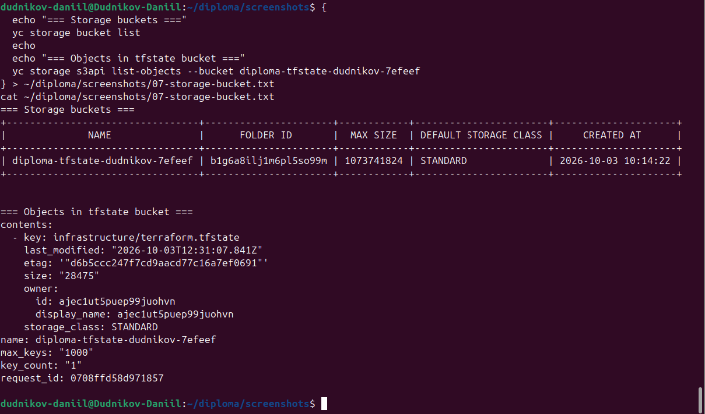

**Что видно:** S3-бакет `diploma-tfstate-dudnikov-7efeef`,
используемый как backend для Terraform state.

**Зачем:** подтверждает, что state хранится удалённо,
а не на локальной машине — это позволяет работать с инфраструктурой
из любого места и не терять состояние.

---

## 08-terraform-outputs — outputs

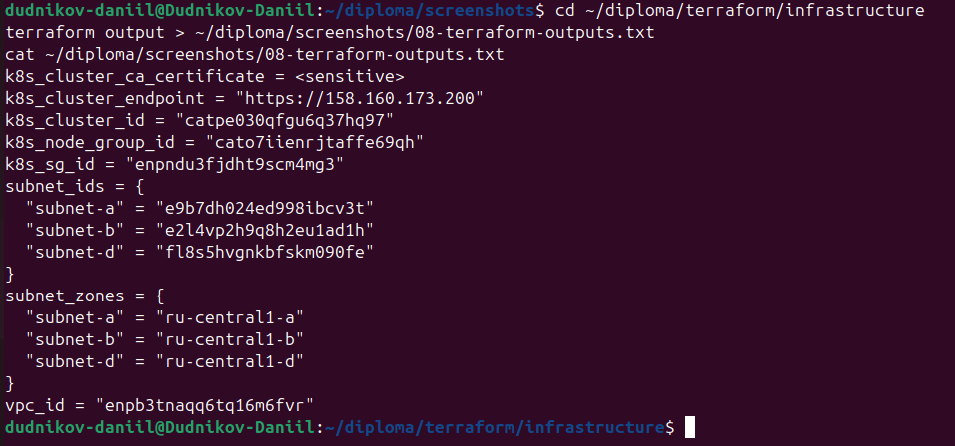

**Что видно:** ключевые outputs Terraform — ID кластера, ID node group,
endpoint, ID сетей.

**Зачем:** подтверждает, что инфраструктура описана декларативно
и её параметры легко получить программно.

---

## 09-terraform-state — список ресурсов

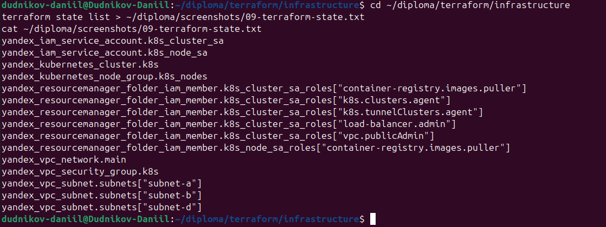

**Что видно:** все ресурсы, управляемые Terraform — VPC, подсети,
security group, кластер, node group, сервисные аккаунты.

**Зачем:** подтверждает, что инфраструктура полностью описана кодом
(IaC), без ручных действий в консоли.

---

## 10-yc-console-overview — консоль Yandex Cloud

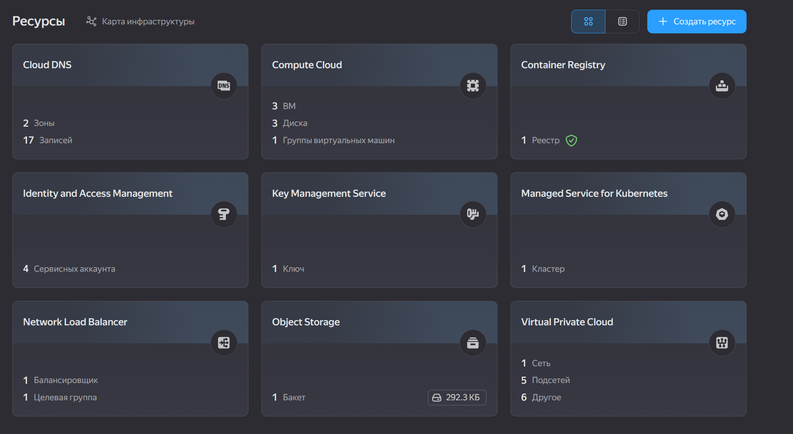

**Что видно:** общий обзор облака — folder, ресурсы, квоты.

**Зачем:** удобный общий вид для проверяющего, показывает,
что всё находится в одном folder.

---

## 11-yc-console-infrastructure-map — карта инфраструктуры

**Что видно:** визуальная карта связей между VPC, подсетями,
кластером и виртуальными машинами.

**Зачем:** самый наглядный скриншот для защиты — сразу видно
архитектуру целиком.

---

## 15-kubectl-nodes — ноды (этап 5)

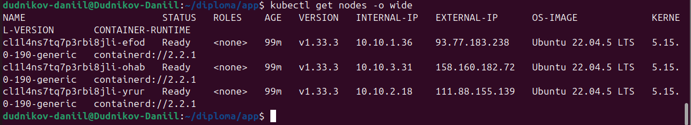

**Что видно:** ноды с расширенной информацией — IP-адреса,
версия kubelet, ОС, ядро.

**Зачем:** дополнительное подтверждение работоспособности
на финальном этапе (после деплоя приложения и мониторинга).

---

## 16-kubectl-pods — поды (этап 5)

**Что видно:** все поды во всех namespace — приложение,
мониторинг, ingress, системные.

**Зачем:** финальное подтверждение, что кластер работает
под полной нагрузкой.

---

## 17-ingress-nginx — ingress-nginx

**Что видно:** поды ingress-nginx в статусе `Running`,
внешний LoadBalancer с публичным IP.

**Зачем:** подтверждает, что трафик из интернета доходит
до приложения через ingress.
