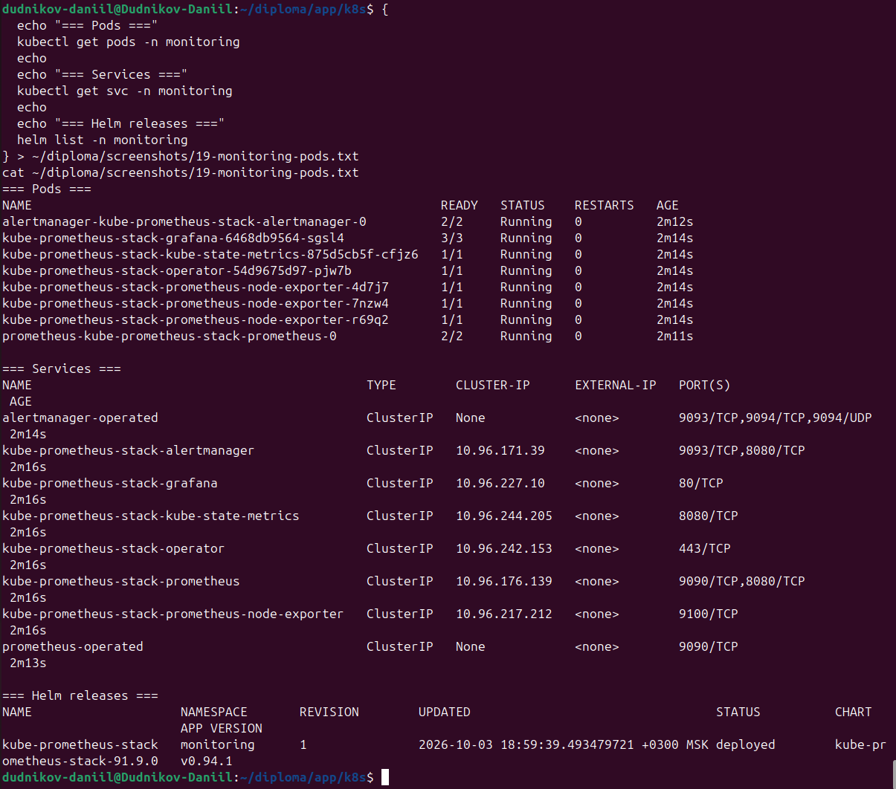

# 03. Мониторинг

Третий этап практикума: развёртывание системы мониторинга
на базе kube-prometheus-stack — Prometheus, Grafana, Alertmanager
и экспортёры метрик.

---

## 19-monitoring-pods — поды мониторинга

**Что видно:** поды Prometheus, Grafana, Alertmanager,
kube-state-metrics, node-exporter — все в статусе `Running`.

**Зачем:** подтверждает, что весь стек мониторинга развёрнут
и работает.

---

## 20-grafana-dashboard — CPU/Memory

**Что видно:** дашборд с графиками загрузки CPU и потребления памяти
по namespace и подам кластера.

**Зачем:** подтверждает, что Prometheus собирает метрики,
а Grafana их визуализирует.

---

## 20a-grafana-storage — IOPS/Storage

**Что видно:** графики дисковых операций — IOPS, throughput,
использование места.

**Зачем:** подтверждает корректную работу node-exporter
и сбор метрик с нод.

---

## 20b-grafana-networking — Networking

**Что видно:** сетевые метрики — входящий/исходящий трафик,
ошибки, drops.

**Зачем:** позволяет отслеживать состояние сети кластера
и приложения.

---

## 20c-grafana-dashboards-list — список дашбордов

**Что видно:** список установленных дашбордов
(kube-prometheus-stack идёт с десятками готовых).

**Зачем:** удобно, когда основные метрики кластера
уже визуализированы — не нужно собирать панели с нуля.
