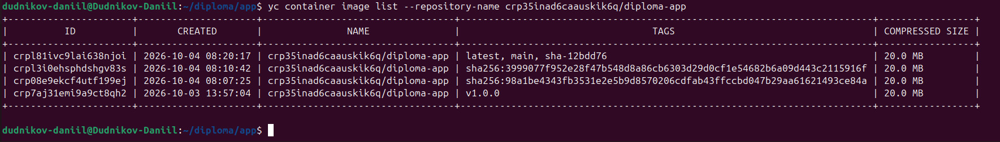
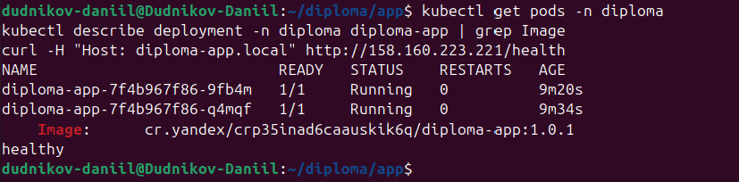
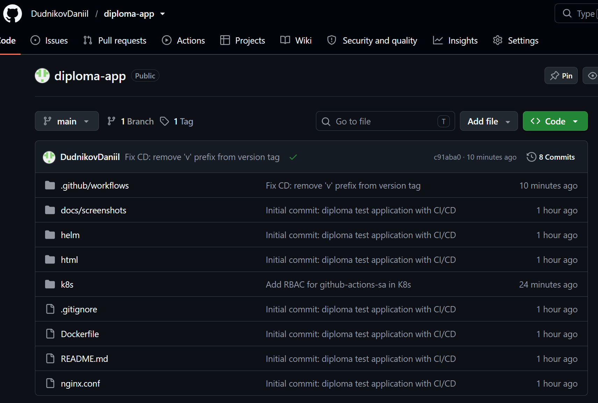

# 04. CI/CD Pipeline

Четвёртый этап практикума: настройка CI/CD на GitHub Actions —
автоматическая сборка Docker-образа при коммите в `main`
и автоматический деплой в Kubernetes при создании тега.

---

## 21-github-actions-ci — CI pipeline (main)

**Что видно:** успешный workflow на GitHub Actions, запущенный
по push в ветку `main`. Шаги: checkout, авторизация в YCR,
`docker build`, `docker push`.

**Зачем:** подтверждает, что CI настроен и автоматически
собирает образ при каждом коммите.

---

## 22-yc-registry-after-ci — образ в YCR

**Что видно:** образ `diploma-app` в YCR с тегом, соответствующим
последнему коммиту в `main`.

**Зачем:** подтверждает, что CI действительно доставляет образ
в registry, а не просто «зелёный» в GitHub.

---

## 23-github-actions-cd — CD pipeline (v1.0.1)

**Что видно:** успешный workflow, запущенный по созданию тега
`v1.0.1`. Шаги: сборка образа с тегом, push в YCR,
`kubectl apply` в кластер.

**Зачем:** подтверждает, что CD настроен и автоматически
деплоит новую версию при релизе.

---

## 24-kubectl-pods-after-cd — поды после CD

**Что видно:** под приложения `diploma-app` пересоздан
с новым образом, статус `Running`.

**Зачем:** подтверждает, что деплой через CD реально
дошёл до кластера и приложение обновилось.

---

## 25-github-repo — репозиторий GitHub

**Что видно:** репозиторий с кодом, Dockerfile, манифестами
и workflow-файлами.

**Зачем:** проект можно склонировать и повторить с нуля
в любой момент.
